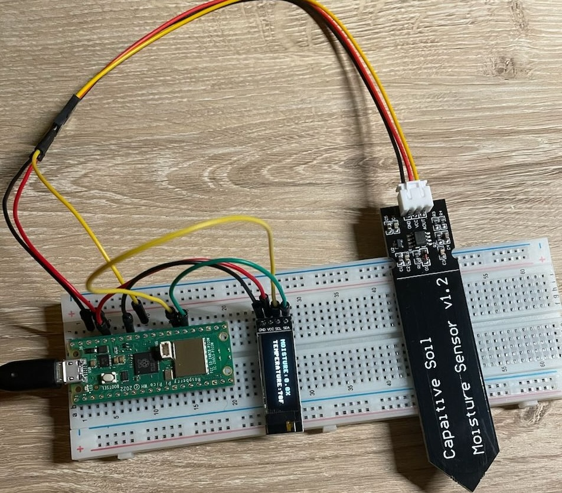

## Raspberry Pico + Moisture Sensor + OLED Display

This project is aiming to explore how to
1. Measure data from Capacitive Soil Moisture Sensor v1.2
2. Read temperature from Pico's embedded Temperature Sensor
3. Display collected data on SSD1306 OLED display

### Implementation

